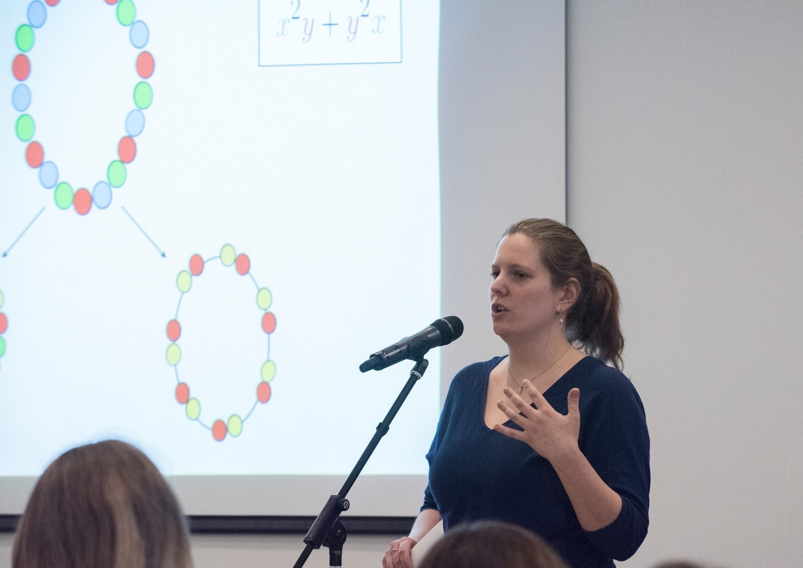

Étudiante au doctorat à l'Université du Québec à Montréal [(UQAM)](https://math.uqam.ca/)

Département de Mathématiques 

Laboratoire de Combinatoire et d'Informatique Mathématique [(LaCIM)](http://lacim.uqam.ca/)

# Intérêts en recherche

Combinatoire algébrique et énumérative. Théorie de la représentation et des caractères. Fonctions symétriques. 

# Contributions à Sage 
[Voir mes contributions à Sage](sage.md)

# Cours enseignés 
- [MAT0341](https://etudier.uqam.ca/cours?sigle=MAT0341) : Calcul intégral et différentiel (UQAM), hiver 2017
- [MAT0341](https://etudier.uqam.ca/cours?sigle=MAT0341) : Calcul intégral et différentiel (UQAM), automne 2017
- [MAT1600](https://etudier.uqam.ca/cours?sigle=MAT1600) : Algèbre matricielle (UQAM), hiver 2017

[create an anchor](# Nouvelles section)
