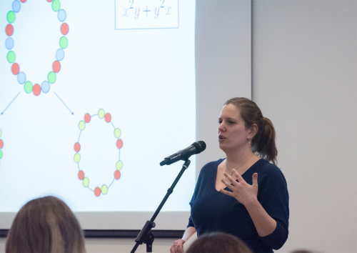

# 

## Informations personnelles

email : hubert.pauline@courrier.uqam.ca

CV (à ajouter)

  

*Photo : Concours Ma thèse en 180 secondes (12 avril 2018)*

Je suis actuellement étudiante au doctorat à l'Université du Québec à Montréal [(UQAM)](https://math.uqam.ca/)
en combinatoire sous la direction de [François Bergeron](http://bergeron.math.uqam.ca/fr/) au [(LaCIM)](http://lacim.uqam.ca/) à Montréal 
et de [Nicolas Thiéry](http://nicolas.thiery.name/) au [LRI](https://www.universite-paris-saclay.fr/fr/recherche/laboratoire/laboratoire-de-recherche-en-informatique-lri) à Paris-Saclay.  

## Intérêts en recherche

Mon projet de recherche porte sur la théorie de la représentation et des caractères. 
J'étudie plus particulièrement l'action du groupe symétrique et du groupe général linéaire
sur des modules générés par des polynômes harmoniques et des opérateurs de dérivation et de polarisation. 

